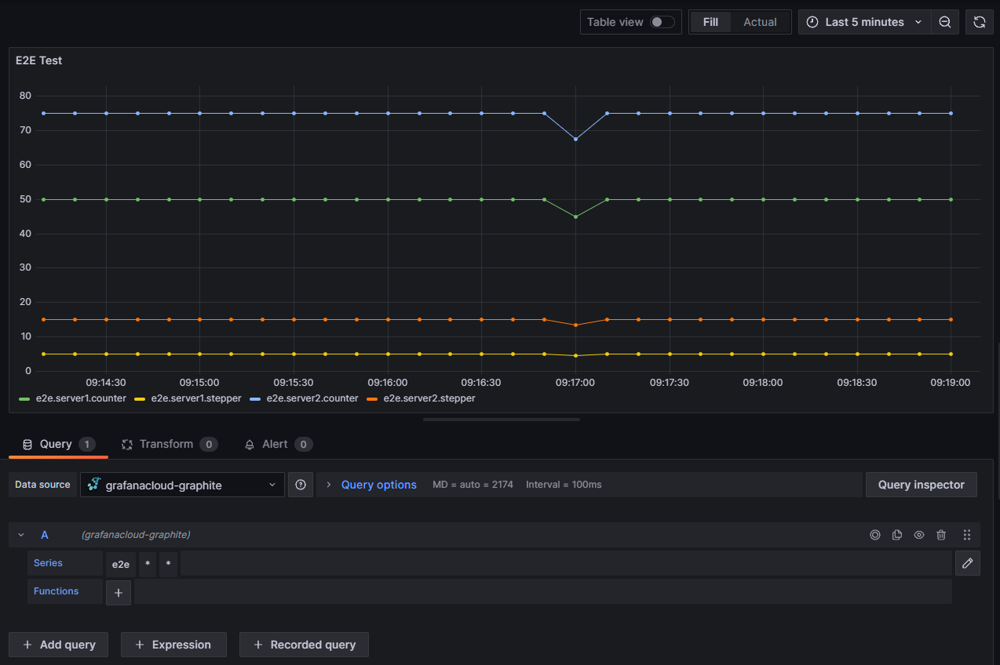

# Grafana Cloud Graphite Metrics Client

This package provides a simple way to send metrics to a Grafana Cloud Graphite server. It includes support for counters and interval metrics.

Provide easy use for: https://grafana.com/docs/grafana-cloud/monitor-infrastructure/metrics/metrics-graphite/http-api/

### Installation

To install this package, use npm:

```bash
npm install graphite-metrics-handler
```

### Requirements

- Grafana Cloud: [Get free account](https://grafana.com/auth/sign-up?refCode=gr8zEPmXdDewWfA)

- Grafana Access Token(metrics:write): https://grafana.com/orgs/YOUR_ORGS/access-policies

- Grafana Graphite UserId: https://grafana.com/orgs/YOUR_ORGS

### Usage

To use this package, first import the GraphiteMetrics class:

```javascript
import { GraphiteMetrics } from "graphite-metrics-handler";
```

Then, create a new instance of the class with your Graphite server options:

```javascript
const Metrics = new GraphiteMetrics({
  userId: "5435231"; // Grafana Graphite UserId
  token: "glc_kyupkp..."; // Grafana Access Token
  ingestEndpointURL:  "https://something.grafana.net/graphite/metrics",
  namespace: "e2e",
});

```

You can then register counters and interval metrics with the `registerCounter` method:

```javascript
// Register a counter metric with 60.000ms (1 minute) reporting interval
const dbCounterAll = Metrics.registerCounter("db.query.all", 60000);
const dbCounterError = Metrics.registerCounter("db.query.error", 60000);
```

Use counter example:

```javascript
try {
  dbCounterAll.inc();
  await db.query("SELECT * FROM users");
  // do some DB query
} catch (error) {
  dbCounterError.inc();
  // some error handling
}
```

To stop reporting metrics / clearIntervals, call the stop method:

```javascript
Metrics.stop();
```

### Use metrics on Grafana Dashboard



### License

This package is licensed under the MIT License. See the LICENSE file for details.
